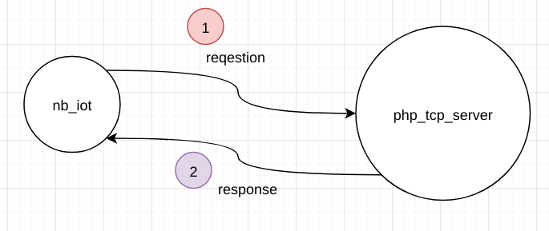

### 基于NB-IOT的防老人跌倒系统设计与实现

    班级：18计科（1）班
    学号：18050506120 1805056109
    姓名：刘泳 黄圣峰
    指导老师：陈翠和

### 项目背景

跌倒是我国65岁以上老年人因伤害逝世的主要原因。据统计，老年人产生伤口性骨折的主要原因是跌倒，年龄越大，产生跌倒及因跌倒而受伤或逝世的危险越高。在老年人居家生活、外出活动和机构养老中，苏州新导推出的防老人跌倒系统需求综合采取适老化改造、自我训练、加强巡视、使用辅具等多种措施防备老年人跌倒，降低白叟跌倒的概率、减缓伤害程度。

2006年全国疾病监测体系死因监测数据显现：我国65岁以上老年人跌倒逝世率男性为49.56/10万，女性为52.80/10万。对于老年人来说，随着年龄的增长，骨头变得更薄。如果骨头过分薄，还可能引起骨质疏松症。骨质疏松症会使骨骼更加脆弱。骨骼较弱的人在跌倒时也更容易骨折。另外，行走困难、难以保持平衡、药物作用、血压影响等等都是老年人的跌倒因素。

本系统通过使用ADXL345加速度传感器，在老人跌倒时自动向子女发送电子邮件或短信提醒，达到即时反应和处理的效果来防止老人受到更重伤害。本设计使用STM32 F407主控，采用三轴加速度传感器对人体x、y、z三个方向加速度值进行采集，分析，然后判断是否摔倒。

### 硬件选型

STM32 F407开发板
ADXL345加速度传感器

#### 加速度传感器

##### 简介

* ADXL345是一款小而薄的超低功耗3轴加速度计
* 它可以测量静态重力加速度和运动或冲击导致的动态加速度
* 其高分辨率(3.9mg/LSB),能够测量不到1.0°的倾斜角度变化
* 分辨率高(13位),测量范围达± 16g
* 可通过SPI(3线或4线)或I2C数字接口访问
* 数字输出数据为16位二进制补码格式

##### 硬件电路图

##### 工作原理

ADXL345是一款完整的3轴加速度测量系统,可选择的测量范围有±2 g,±4 g,±8 g或±16 g。既能测量运动或冲击导致的动态加速度,也能测量静止加速度,例如重力加速度,使得器件可作为倾斜传感器使用。该传感器为多晶硅表面微加工结构,置于晶圆顶部。由于应用加速度,多晶硅弹簧悬挂于晶圆表面的结构之上,提供力量阻力。

差分电容由独立固定板和活动质量连接板组成,能对结构偏转进行测量。加速度使惯性质量偏转、差分电容失衡,从而传感器输出的幅度与加速度成正比。相敏解调用于确定加速度的幅度和极性。

##### adxl345和stm32_f407的通信方式

这里我用的是`I2C`接口来进行数据传输,其电路图如下:

***重要的注意事项***:

* CS引脚拉高至VDD I/O,ADXL345处于I2C模式
* 如果`ALT ADDRESS`引脚接高电平,器件的7位I2C地址是0x1D,随后为R/W位。0x3A表示写入,0x3B表示读取。
* 如果`ALT ADDRESS`引脚接地,可以选择备用I2C地址0x53(随后为R/W位)。0xA6写入,0xA7为读取。
* 对于任何不使用的引脚,没有内部上拉或下拉电阻,CS引脚或ALT ADDRESS引脚悬空或不连接时,任何已知状态或默认状态不存在。即使用`I2C`时, `CS`引脚必须连接至`VDD I/O`,`ALT ADDRESS引`脚必须连接至任一`VDD I/O`或`接地`。

##### 排线连接与寄存器地址配置

根据以上注意事项，我的配置如下(我的开发板在`ALT ADDRESS`接`3.3V`下会无法开机,所以用的是方法一):

根据adxl手册，我们配置adxl所有寄存器的地址:

stm32cubeMX配置图

实物连接图

#### bc35g 

##### 简介

bc35g是一款多频段、高性能、低功耗的NB-IoT无线通信模块

超低功耗和超宽工作温度范围，BC35-G 成为 IoT 应用领域的理想选择，常被用于无线抄表、共享单车、智能停车、智慧城市、安防、资产追踪、智能家电、农业和环境监测以及其它诸多行业，以提供完善的短信和数据传输服务。

##### 工作原理

说明: 对内来说，bc35和stm32是通过串口来通信的; 对外来是，bc35是和基站进行通信的，基站管理bc35并转发bc35的消息

##### 排线连接与配置

stm32cubeMX配置图

实物连接图

### 系统功能框图

vue前端websocket页面:

### 系统架构

对nb_iot和php服务器来说，系统架构是典型的`C/S`架构:

从nb_iot这个板子整体来看，系统架构采用的是`分层`思想下的分层架构,请看系统类图:

### 通信协议设计与实现

#### 通信协议

我们目前由于是学习阶段，重点学的是原理(怎么制定协议，怎么构造包，怎么解包)，所以没有直接用标准协议(比如mqtt协议等)，而是自己制定协议把数据构造成二进制包并通过tcp把数据包发送出去。

#### 制定协议

在nb_iot开发板这一侧，我们是借助于c语言的结构体来充当数据包的载体的，请看:

必要的说明(结构体和二进制数组的互相转换):

注意事项:

在x86平台下测试某些数据会出问题，请看:

解决: 在arm平台下就不会有问题

#### 数据打包和数据解包

这里以nb_iot向php_tcp_server发送绑定iot_term_id的请求为例讲解代码,此后将不再详细讲解代码:

1. nb_iot方构造对php_tcp_server的请求包(即nb_iot上电后，nb_iot向php服务器发送绑定iot_term_id到php_tcp_client_id的请求)

    

2. php_tcp_server方收到iot的请求包后，对该二进制请求包按照我们自己制定的协议进行解包

    

3. 解包后，php_tcp_server方构造对nb_iot的响应包(即php_server收到nb_iot的绑定iot_term_id的请求后，对nb_iot请求的响应),然后把响应包响应回nb_iot

    

4. nb_iot收到php_tcp_server的响应包后，对该数据包解包

### 终端功能设计

#### 无线数据发送

序列图:

#### 无线数据接收

序列图:

### gdb调试

### 云服务器功能设计

#### nb_iot数据上报类请求(nb_iot --> php_tcp_server --> nb_iot)

##### nb_iot请求php_tcp_server绑定iot_term_id到php_tcp_server_client_id

流程图:

##### nb_iot请求php_tcp_server对老人摔倒进行报警

流程图:

#### 浏览器websocket控制nb_iot类型的请求(brower_websocket --> php_ws_server --> nb_iot_tcp --> php_tcp_server --> brower_ws)

##### 浏览器ws请求操作(打开或关闭)nb_iot的led灯

流程图:

##### 浏览器ws请求获取nb_iot的温湿度

流程图:

##### 浏览器ws请求获取nb_iot上adxl加速度传感器x,y,z轴数据并实时在前端显示

流程图:

### 总结

 
