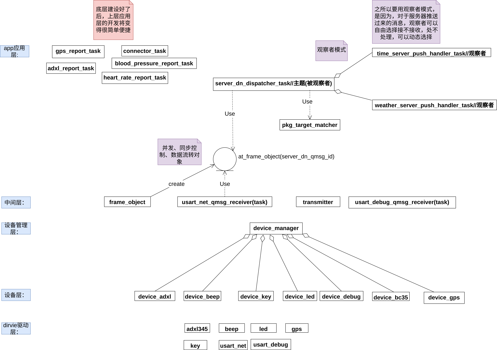
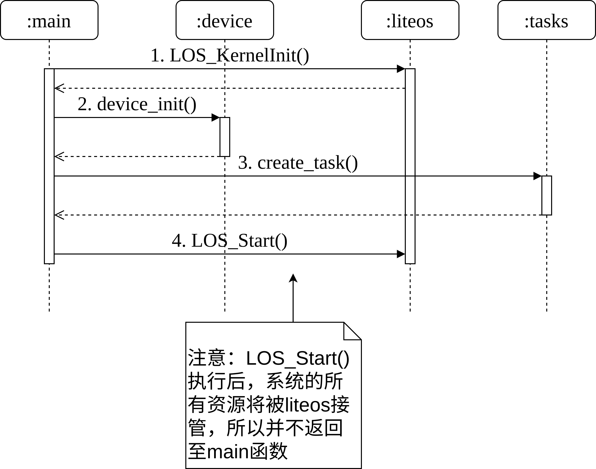

## 基于 NB-IOT的防老人跌倒系统设计与实现(tlnr极简版)

## 系统工作原理

核心功能:


扩展功能：


## 系统软硬件组成

系统架构：


## 系统软件类图

总体缩略类图：



驱动模块设计缩略类图(面向对象语言适用)：


驱动模块设计类图(面向过程语言模块化自下而上适用)：


设备层设计类图：


中间层设计类图：


应用层设计类图：


## 通信协议设计


* tag: 标识符，默认为`IOT`
* len: 长度，即包首+载荷+包尾
* type: 包类型，主要有观察包、上报包、动作包、推送包等
* id: 设备id，设备唯一标识
* seq: 序列号
* check_sum：校验和，用于帮助发现传输错误
* 载荷：正在携带数据的部分，长度不固定
* 包尾：默认为`\r\n`

详细类图：


## 软硬件选型及工作原理

### 硬件选型及工作原理

#### bc35-g网络模组

bc35-g是一款多频段、高性能、低功耗的NB-IoT无线通信模组

超低功耗和超宽工作温度范围，BC35-G 成为 IoT 应用领域的理想选择，常被用于无线抄表、共享单车、智能停车、智慧城市、安防、资产追踪、智能家电、农业和环境监测以及其它诸多行业，以提供完善的短信和数据传输服务。

##### 优点

* 省电: PSM工作模式下典型耗流只有3uA
* 网络协议栈丰富: 支持IPv4/IPv6/UDP/CoAP/LwM2M/Non-IP/DTLS/TCP/MQTT等协议
* 提供了对短信的支持：PDU模式，和点对点MO和MT模式
* 三种工作模式：Active、Idle、PSM，精确控制能耗

#### AXDL345加速度传感器

* ADXL345是一款小而薄的超低功耗3轴加速度计

* 它可以测量静态重力加速度和运动或冲击导致的动态加速度

* 其高分辨率(3.9mg/LSB),能够测量不到1.0°的倾斜角度变化

* 分辨率高(13位),测量范围达± 16g

* 可通过SPI(3线或4线)或I2C数字接口访问

* 数字输出数据为16位二进制补码格式

##### 硬件电路图


##### 工作原理

ADXL345是一款完整的3轴加速度测量系统,可选择的测量范围有±2 g,±4 g,±8 g或±16 g。既能测量运动或冲击导致的动态加速度,也能测量静止加速度,例如重力加速度,使得器件可作为倾斜传感器使用。该传感器为多晶硅表面微加工结构,置于晶圆顶部。由于应用加速度,多晶硅弹簧悬挂于晶圆表面的结构之上,提供力量阻力。

差分电容由独立固定板和活动质量连接板组成,能对结构偏转进行测量。加速度使惯性质量偏转、差分电容失衡,从而传感器输出的幅度与加速度成正比。相敏解调用于确定加速度的幅度和极性。

##### 通信方式

##### I2C(Inter-Integrated Circuit)总线接口

* I2C英文全称Inter-Integrated Circuit，它是一种串行通讯总线，使用多主从架构，由飞利浦公司（恩智浦NXP的母公司）在80年代开发，用于主板、嵌入式系统连接周边低速设备。

* I2C由两条双向开漏线组成，接线简单。两条线利用上拉电阻将电位上拉。典型电位为+3.3V或+5V。标准传输速率为100Kb/s，低速模式10Kb/s。

* I2C总线支持三种传输模式。在标准模式下可达100kbit/s；在快速模式下可达400kbit/s；在高速模式下可达3.4Mbit/s。

I2C原理图：


重要的注意事项:

* CS引脚拉高至VDD I/O,ADXL345处于I2C模式

* 如果ALT ADDRESS 引脚接高电平,器件的7位I2C地址是0x1D,随后为R/W位。0x3A表示写入,0x3B表示读取。

* 如果ALT ADDRESS 引脚接地,可以选择备用I2C地址0x53(随后为R/W位)。0xA6写入,0xA7为读取。

* 对于任何不使用的引脚,没有内部上拉或下拉电阻,CS引脚或ALT ADDRESS引脚悬空或不连接时,任何已知状态或默认状态不存在。即使用I2C 时, CS 引脚必须连接至VDD I/O ,ALT ADDRESS引 脚必须连接至任一VDD I/O 或接地 。

I2C总线物理拓扑图：


说明：

一共只有两条总线，一条SDA(serial data)数据线用来承载数据、一条SCL(serial clock line)时钟线用来控制数据收发时序。所有I2C设备的SDA都接到了总线的SDA上，SCL都接到了总线的SCL上。每个设备都有自己的唯一地址，以保证设备之间访问的准确性
半双工，因为只有一条数据线

##### I2C通信原理

I2C时序图：

初始状态(即空闲状态)：SDA与SCL均为上拉电阻所致的高电平时为初始状态；

开始信号：当SCL为高电平的时候，SDA被拉低，此为开始信号，表明通讯开始。

终止信号：当SCL为高电平的时候，SDA被拉高，此为终止信号，表明本次通讯结束。


应答信号：当发送器向接收器发送完一个字节/8位数据后，第9个时钟周期内，接收器必须给发送器一个应答信号，这样数据才算传输成功。高电平表非应答，低电平表应答。


#### STM32F407 MCU主控制器

STM32F4是由ST（意法半导体）开发的一种高性能微控制器系列。其采用了90nm的NVM工艺和ART技术（自适应实时存储加速器，Adaptive Real-Time MemoryAccelerator™）。

### 软件选型

#### LiteOS嵌入式操作系统

Huawei LiteOS,轻量级物联网操作系统,物的智能化使能平台,可广泛应用于个人穿戴、智能家居、智能照明、智能停车等面向个人、家庭和行业的物联网产品和解决方案。

Huawei LiteOS是华为面向物联网领域开发的一个基于实时内核的轻量级操作系统。现有基础内核包括不可裁剪的极小内核和可裁剪的其他模块。极小内核包含任务管理、内存管理、异常管理、系统时钟和中断管理。可裁剪模块包括信号量、互斥锁、队列管理、事件管理、软件定时器等。为开发者开发应用层软件提供了极大的便利。

#### redis/mysql/kafka

* redis是高性能内存数据库

* mysql是主流磁盘数据库

* kafka是大数据平台中一种高吞吐量的分布式发布订阅消息系统，它可以处理消费者在网站中的所有动作流数据。

#### springCloud

Spring Cloud是一系列框架的有序集合。它利用Spring Boot的开发便利性巧妙地简化了分布式系统基础设施的开发，如服务发现注册、配置中心、消息总线、负载均衡、断路器、数据监控等，都可以用Spring Boot的开发风格做到一键启动和部署。

## 跌倒检测模型构建和算法设计

### 目前市面上老人跌倒检测存在的不足

    几乎都是各类陀螺仪或加速度传感器在IOT这一侧的简单检测，主要方法有如下：
    
    1.失重检测(free_fall中断事件:当加速度值低于一定阈值并且持续超过一定的时间时，Free_fall中断置位)
    
    2.撞击检测(activity中断事件:当加速度值超过一定阈值时，Activity中断置位)
    
    3.静止检测(inactivity中断事件:当加速度值低于一定阈值且持续超过一定时间时，Inactivity中断置位。)
    
    4.与初始状态检测比较(摔倒前和摔倒后adxl数据发生较大变化)

传统摔倒检测算法流程图如下：


说明：

首先通过free_fall检测失重事件是否产生，如果是失重，再隔200ms后，检测是否有activity碰撞事件的发生，如果没有，说明可能是弯腰等动作造成的失重，如果有，再检隔几秒后检测Inactivity事件，看在碰撞后老人是否静止不动了，如果不是，说明可能是下楼梯等动作造成的失重和碰撞，如果是，进入最终判断。

分析：

    该方法的优点是实现简单，缺点是检测方法单一，不够可靠，不够智能，也不够全面。
    
    不可靠主要有两种情况：
    
    1.老人已摔倒，但没检查出来
    
    2.老人没摔倒，但是误判了

### 基于多种手段的综合跌倒检测模型设计

架构图：


如图xx所示，在IOT这一侧，IOT中的各个传感器(adxl加速度、心率、血压等传感器)数据会被我们编写的传感器数据实时上报进程集上报给云服务器进行处理(包括数据存储，数据分发等)，而云端的人工智能跌倒检测模型则会对数据进行实时训练和跌倒检测，其中训练好的数据会存储到已训练的数据仓库中去，并在未来对各个企业进行开放数据集，方便各个企业定制自己的检测模型。一旦人工智能检测模型检测到老人有可能跌倒，则会把一个准确率以百分比的形式返回到IOT侧的跌倒二级检测器进程中去，再结合IOT侧的adxl加速度跌倒检测器、血压异常波动检测器、心率异常波动检测器的准确率的百分比，汇总到跌倒综合检测器中去，每种检测器都会有一个权重，用于表示每种检测器所占总体检测的分量，一旦累计加权值的准确率高于一个阈值，则在IOT这一侧将会通过串口网络给云服务器发送一个报警请求包，云服务器收到报警包后，将调用微服务集中的各个报警通知服务，以通知老人家属(包括把gps位置信息发送给老人家属)。

#### 优点

    跌倒检测可靠性强：
    
    不再是单一的检测，不再只是本地检测，准确率高
    
    可配置的检测级别：
    
    level1:只使能adxl、血压检测、心率检测等本地检测器
    
    level2:只使能python人工智能等远程检测器
    
    level3:本地检测器和远程检测器综合判断是否跌倒
    
    可配置的权重分配算法：
    
    权重分配算法可灵活配置，甚至可有rpc远程过程调用
    
    高耦合，低内聚，各模块职责单一且明确，可灵活扩展

#### 缺点

    时间成本高，费时费力
    
    设计复杂，实现有难度

#### 问：是否属于过度设计？

请注意，我们的服务是面向各企业的，企业下面又会有大量的IOT跌倒产品(可能是千万量级)，这意味着，系统负载和流量很大。以数据存储为例，请看下图：


如上，是不是过度设计一目了然。

此设计优点：

当你有上千万用户时，压力来到了服务器这一端，所以必须微服务架构；当你有千万用户时，数据将成为最宝贵的财富；但你客户量越来越大越来越大人认可你的产品时，你就可以扩展你的产品（比如从手环变成手机的一个小模块），所以模块化，服务化，平台化，大架构化的设计绝不是过度设计，这样方便未来的维护和扩展性

### 跌倒检测算法的设计

基本思想如图：


总结：

就是不断给python跌倒检测学习程序喂数据，检测学习程序根据各种情况和场景下实时上报数据不断更新自己的跌倒检测准确程度

对有限的跌倒样本数据进行学习，提高自己的"智能"程度，理想的效果是在老人还未跌倒即将跌倒时，就能根据过去时刻上报的数据的综合情况预测老人在未来几毫秒甚至几秒内是否会跌倒。

如果能够提前预测，安全气囊就可以发挥作用，而不仅仅只是报警通知老人家属这种跌倒后的就医补救措施

## 系统详细设计与实现

### 驱动层设计与实现

驱动层比较简单，这里只以类图的形式给出：


### 中间层设计与实现

bc35模组网络通信之数据发送序列图：


bc35模组异步消息接收与数据分发序列图:


### 应用层设计与实现

#### IOT侧和服务端侧应用层功能总览

##### 数据上报


##### 数据推送


##### 数据请求和设备控制


#### IOT侧设计与实现

pkg网络字节流数据包构造序列图(这里以adxl数据上报请求包构造为例)：


应用层数据上报序列图(这里以adxl345加速度数据上报为例)：


## 通信协议实现

### 制定协议

包首(大小固定不变)：

    typedef struct {
        char tag[3];//标识符
        uint16_t len;
        uint8_t type;
        uint32_t id;//终端id
        uint8_t seq;
        uint16_t check_sum;
    } pkg_head_st;

* tag为固定的`IOT`标识
* type有:

    ```
    #define PKG_ACTION 0x01
    #define PKG_OBSERVER 0x02
    #define PKG_IOT_PUSH 0x03//IOT上报的数据包
    #define PKG_SERVER_PUSH 0x04//服务器推送过来的数据包
    ...
    ```

target有：

    #define TARGET_BEEP 0x01
    #define TARGET_LED 0x02
    #define TARGET_GPS 0x03
    #define TARGET_ADXL 0x04
    ...

包尾(默认以`\r\n`结尾)

载荷(大小动态变化)：

------------------------------------------------------------------------

动作包：用以控制IOT侧上的硬件设备

    typedef struct {
        uint8_t target;
        uint8_t act;
    } pkg_act_s;
    
    typedef struct {
        uint8_t target;
        uint8_t resp_code;
    } pkg_act_resp_s;

act：控制动作

    #define ACT_BIND_TERMID_TO_UID 0x01
    #define ACT_LED_ON 0x02
    #define ACT_LED_OFF 0x03
    #define ACT_BEEP_ON 0x04
    #define ACT_BEEP_OFF 0x05
    #define ACT_ADXL_ALARM 0x06
    ...

------------------------------------------------------------------------

观察包：用以观察IOT侧硬件设备的运行情况或查询IOT侧相关传感器的数据

gps数据观察:

请求：

    typedef struct {
        uint8_t target;
    } pkg_observer_st;

响应：
    
    typedef struct {
        uint8_t target;
        float latitude;//纬度
        float longitude;//经度
        uint32_t speed;
        uint32_t verticalAccuracy;//垂直精度
        uint32_t horizontalAccuracy;//水平精度
        uint8_t resp_code;
    } pkg_observer_gps_resp_st;

adxl数据观察:

请求：

    typedef struct {
        uint8_t target;
    } pkg_observer_st;

响应：

    typedef struct {
        uint8_t target;
        int16_t x;
        int16_t y;
        int16_t z;
        float xang;
        float yang;
        float zang;
        uint8_t resp_code;
    } pkg_observer_adxl_resp_st;

------------------------------------------------------------------------

数据上报包：IOT上报给服务器的数据包

adxl数据上报:

请求：

    typedef struct {
        uint8_t target;
        int16_t x;
        int16_t y;
        int16_t z;
        float xang;
        float yang;
        float zang;
        uint8_t resp_enable;//是否需要服务器的响应(关闭：节省流量；开启：数据有丢失的风险)
    } pkg_report_adxl_st;

响应：

    typedef struct {
        uint8_t target;
        uint8_t resp_code;
    } pkg_report_adxl_resp_st;

gps数据上报:

请求：
    
    typedef struct {
        uint8_t target;
        float latitude;//纬度
        float longitude;//经度
        uint32_t speed;
        uint32_t verticalAccuracy;//垂直精度
        uint32_t horizontalAccuracy;//水平精度
        uint8_t resp_enable;//是否需要服务器的响应(关闭：节省流量；开启：数据有丢失的风险)
    } pkg_report_gps_st;

响应：

    typedef struct {
        uint8_t target;
        uint8_t resp_code;
    } pkg_report_gps_resp_st;

------------------------------------------------------------------------

服务器推送包：服务器推送过来的数据包

time数据推送：

请求：

    typedef struct {
        uint8_t target;
        uint8_t hour;
        uint8_t min;
        uint8_t sec;
        uint8_t resp_enable;//是否需要IOT的响应(关闭：节省流量；开启：数据有丢失的风险)
    } pkg_server_push_time_st;

响应：

    typedef struct {
        uint8_t target;
        uint8_t resp_code;
    } pkg_server_push_time_resp_st;

------------------------------------------------------------------------

最终构造好(根据我们的协议序列化)的数据包：

    typedef struct {
        char *pkg_buf;//已构造好的包(序列化)，指向一个1024直接的二进制数组
        uint16_t pkg_len;//包首pkg_head_st的长度+包体的长度+"\r\n"的2个字节
    } pkg_st;

### 构造(序列化，struct到二进制数组的转换)

根据协议构造数据包(序列化)，这里以adxl数据上报中的请求包为例

原理：给结构体中字段赋值，强制类型转换为二进制数组。


#### 示例代码：

    /*
    typedef struct Adxl345_data
    {
        int16_t x;
        int16_t y;
        int16_t z;
        float xang;
        float yang;
        float zang;
    } Adxl345_data;
    */
    pkg_s build_adxl_report_pkg(Adxl345_data *adxl)
    {
        uint16_t len;
        pkg_report_adxl_s *p;//payload指针
        pkg_head_s *h;//head指针
    
        p = (pkg_report_adxl_s *)(pkg_buf + sizeof(pkg_head_s));
    
        p->x = adxl->x;
        p->y = adxl->y;
        p->z = adxl->z;
        p->xang = adxl->xang;
        p->yang = adxl->yang;
        p->zang = adxl->zang;
        p->target = TARGET_ADXL;
        p->resp_enbale = 1;
    
        len = sizeof(pkg_head_s) + sizeof(pkg_report_adxl_s) + 2;
        build_head(len, PKG_IOT_PUSH, 0);
        build_tail(len);
        h = (pkg_head_s *)pkg_buf;
        h->check_sum = get_check_sum(len);
    
        pkg_s pkg;
        pkg.pkg_buf = pkg_buf;
        pkg.pkg_len = len;
    
        return pkg;
    }
    
    uint16_t get_check_sum(uint16_t len)
    {
        uint16_t sum = 0;
        uint16_t *p;
        p = (uint16_t *)pkg_buf;
        for (int i = 0; i < len; i++)
        {
            sum += *(p+i);
        }
        if (len%2 != 0)//奇数个字节
        {
            sum += pkg_buf[len];
        }
        return sum;
    }
    
    void build_head(uint16_t len, uint8_t type, uint8_t seq)
    {
        pkg_head_s *p;
        p = (pkg_head_s *)pkg_buf;
        p->tag[0] = 'I';
        p->tag[1] = 'O';
        p->tag[2] = 'T';
        p->len = len;
        p->type = type;
        p->id = term_id;
        p->seq = seq;
        p->check_sum = 0;
    }
    
    void build_tail(uint16_t len)
    {
        snprintf(pkg_buf+len-2, 10, "%s", "\r\n");
    }

### 解析(反序列化，二进制数组到结构体的转换)

根据协议构造数据包(序列化)，这里以adxl数据上报的响应包为例

原理：把接收到的二进制数据强制类型转换为结构体，把结构体中相应字段的数据提取出来。


#### 示例代码：

    /*input:raw_pkg
      output:pkg_head_s、pkg_report_adxl_resp_s
      return:void
    */
    void parse_adxl_report_resp_pkg(char *raw_pkg, pkg_head_s *h, pkg_report_adxl_resp_s *p)
    {
        memcpy((void *)h, (void *)raw_pkg, sizeof(pkg_head_s));
        printf("head:[\r\n");
        printf("id:%d\r\n", h->id);
        printf("check_sum:%d\r\n", h->check_sum);
        printf("tag:%s\r\n", h->tag);
        printf("len:%d\r\n", h->len);
        printf("type:%d\r\n", h->type);
        printf("]\r\n");
    
        memcpy((void *)p, (void *)(raw_pkg+sizeof(pkg_head_s)), sizeof(pkg_report_adxl_resp_s));
        printf("payload:[\r\n");
        printf("target:%d\r\n", p->target);
        printf("z:%d\r\n", p->resp_code);
        printf("]\r\n");
    }

---------------------------------------------------------------------

## 系统初始化

机器上电启动序列图：



设备初始化序列图：


网络连接初始化状态图：


应用层各task初始化序列图：


## 虚拟设备与老人跌倒软件仿真

### 虚拟bc35设备的意义

* bc35真实设模组需要公网ip，无法使用内网，所以需要自己买域名或服务器

* sim卡欠费停机时，使用虚拟bc35设备，不会耽误手头工作

* 更重要的是，bc35驱动和frame框架的代码不用改，只需要在pc主机增加一个虚拟bc35设备即可(编写代码)

说明：代码当时是赶出来的，质量不行，论文附件中也没放上去，不过本质是linux网络编程和读写/dev/虚拟串口设备，实现也比较简单

### 仿真软件的意义

* 借助ue5的物理引擎，模拟仿真老人跌倒的各种场景，把数据给到python机器学习模型去学习

* 电梯上情况，现实中老人活动的场景复杂，尤其是乡下农村的情况，通过仿真软件模拟各种跌倒场景，让python机器学习模型去获取仿真软件上物理引擎的数据，进行学习，提升"智能"程度

## socket通信遇到的一些问题

问题：select_server数据转发服务存在tcp粘包问题

解决：很简单，接收端每次读取到固定长度才向上层交付数据即可(linux网络编程，不过请注意处理read系统调用被信号打断的问题，while循环+判断read返回值即可)请直接看论文.docx

## 此项目用得到设计模式

### 策略模式

目的：服务端跌倒检测算法的任意替换

请见论文.pdf

### 观察者模式

简略示意代码(此处为便于代码的最简展示，省略了对subject主题的封装):

    #include <stdio.h>
    
    typedef struct observer {
        //char recv_buf[512];
        void (*update)(char *recv_buf);
    } Observer;
    
    Observer *observers[18] = {NULL};
    char *subject_data = "hello observer, I am subject";
    
    void update(char *recv_buf) {
        printf("update\n");
        handler(recv_buf);
    }
    
    void handler(char *recv_buf) {
        printf("handler\n");
        printf("recv_buf:%s\n", recv_buf);
    }
    
    int registerObserver(Observer *observer)
    {
        int ret = -1;
        for (int i = 0; i < 18; i++) {
            if (observers[i] == NULL) {
                observers[i] = observer;
                printf("registerObserver:%p\n", observer);
                ret = 0;
                break;
            }
        }
    
        return ret;
    }
    
    int removeObserver(Observer *observer)
    {
        int ret = -1;
        for (int i = 0; i < 18; i++) {
            if (observers[i] == observer) {
                observers[i] = NULL;
                printf("removeObserver:%p\n", observer);
                ret = 0;
                break;
            }
        }
    
        return ret;
    }
    
    void notifyObserver() {
        for (int i = 0; i < 18; i++) {
            if (observers[i] != NULL) {
                printf("notifyObserver:%p\n", observers[i]);
                observers[i]->update(subject_data);
            }
        }
    }
    
    int main(void)
    {
        int ret;
    
        Observer observer;
        Observer observer2;
        observer.update = update;
        observer2.update = update;
    
        ret = registerObserver(&observer);//观察者调用主题的注册方法把自己注册进主题对象
        printf("ret:%d\n", ret);
        ret = registerObserver(&observer2);
        printf("ret:%d\n", ret);
        
        notifyObserver();//主题数据变化时，将调用观察者的update接口，通知观察者
    
        ret = removeObserver(&observer);
        printf("ret:%d\n", ret);
    
        notifyObserver();
    
        return 0;
    }


